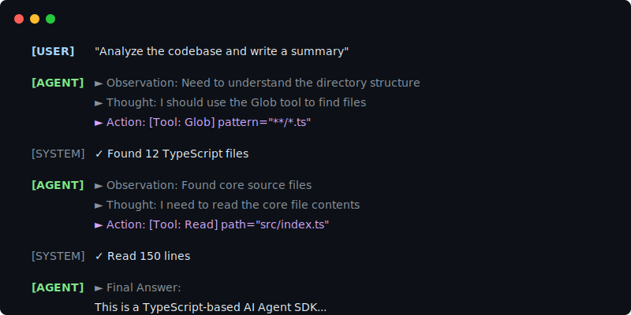

<div align="center">
  

  <h1>Open Agent SDK</h1>

  <p><strong>Open agent runtime and first-party CLI for tool-using AI workflows.</strong></p>

  <p>
    <a href="https://opensource.org/licenses/MIT"></a>
    <a href="https://www.typescriptlang.org/"></a>
    <a href="https://bun.sh/"></a>
  </p>
</div>

Open Agent SDK gives you a ready-to-run terminal agent via `oas` and an embeddable TypeScript runtime for building your own agent products.

The default story is product-first: start with the CLI when you want an end-to-end agent surface, then drop to the SDK when you need custom UX, policies, or infrastructure.

For Codex OAuth, run `codex login` once, then use `provider: 'codex'` in the SDK or `oas --provider codex` in the CLI. The SDK will reuse your local Codex login state from `~/.codex/auth.json`.

If you already manage Codex OAuth outside the CLI, you can also point `oas` at another auth file with `OAS_CODEX_AUTH_PATH`, inject a refreshable credentials JSON blob with `OAS_CODEX_OAUTH_JSON`, or inject a short-lived token with `OAS_CODEX_API_KEY`.

## 1-Minute Quickstart

```bash
npx open-agent-sdk@alpha init my-agent
cd my-agent
npm install
cp .env.example .env
npm run dev
```

Or with Bun:

```bash
bunx open-agent-sdk@alpha init my-agent
```

## 30-Second Demo

<div align="center">
  
</div>

More runnable demos: [Demo Gallery](./DEMO_GALLERY.md).

## Why Open Agent SDK

- Product-shaped entry point: `oas` gives you a first-party terminal agent, while the SDK exposes the same runtime for embedding.
- Production safety controls: permission modes (`default`, `plan`, `acceptEdits`, `bypassPermissions`) and per-tool gating via `canUseTool`.
- Agent extensibility core: hooks, skills, subagents, and MCP-compatible tool integration.
- Reproducible evaluation path: benchmark the CLI like an agent product and reuse the runtime in custom apps.

See details in:
- [API Reference](./docs/api-reference.md)
- [SWE-bench Guide](./benchmark/swebench/README.md)
- [Terminal-bench Guide](./benchmark/terminalbench/README.md)
- [Benchmarks](./BENCHMARKS.md)

## Concepts

- `CLI surface`: `oas` runs the same core runtime exposed by the SDK.
- `Agent loop`: multi-turn ReAct with tool execution.
- `Tool permissions`: explicit allow/deny policy hooks.
- `Hooks`: lifecycle/tool events for observability and control.
- `Subagents`: task delegation and orchestration.
- `Sessions`: create, save, resume, and fork conversations.

## Example Gallery

- [Interactive Code Agent CLI](./examples/code-agent/README.md)
- [Quickstart Tests (basic/session/tools)](./examples/quickstart/README.md)
- [Skill System Demo](./examples/README.md#skill-system-demo)
- [Structured Output Demo](./examples/structured-output-demo.ts)
- [File Checkpoint Demo](./examples/file-checkpoint-demo.ts)

## Evaluation

- SWE-bench Lite smoke/batch runners: `benchmark/swebench/scripts/`
- Terminal-bench Harbor adapter and runbook for the CLI agent surface: `benchmark/terminalbench/`
- Result summarization scripts and artifacts: see [BENCHMARKS.md](./BENCHMARKS.md)

## Integrations

Primary surfaces:

- `oas` first-party CLI
- TypeScript SDK API

Current provider support in the runtime:

- Codex OAuth
- OpenAI
- Google Gemini
- Anthropic

Ecosystem integrations:

- MCP server integration support
- Harbor adapter for Terminal-bench

## Docs

- Homepage: https://openagentsdk.dev
- Docs: https://docs.openagentsdk.dev
- GitHub: https://github.com/OasAIStudio/open-agent-sdk
- [Introduction](./docs/introduction.md)
- [Migration and Claude Agent SDK comparison](./docs/claude-agent-sdk-comparison.md)

## Monorepo Layout

```text
packages/
  core/        # SDK implementation
  web/         # product homepage (Next.js)
  docs/        # docs site (Astro + Starlight)
examples/      # runnable examples
benchmark/     # eval harness and scripts
docs/          # engineering docs, workflows, ADRs
```

## Development

```bash
# install dependencies
bun install

# build core package
bun run build

# run tests
bun test

# run coverage
bun test --coverage

# type check
bun run typecheck
```

Integration tests with real LLM APIs:

```bash
env $(cat .env | xargs) bun test
```

Codex smoke test with your existing local login:

```bash
cd packages/core
bun test tests/e2e/providers/codex.test.ts
```

## Project Status

Current release line: `0.1.0-alpha.x`.

The repository is under active development. APIs may evolve before stable `1.0.0`.

## Contributing

Please read [CONTRIBUTING.md](./CONTRIBUTING.md) before opening PRs.

## License

[MIT](./LICENSE)
